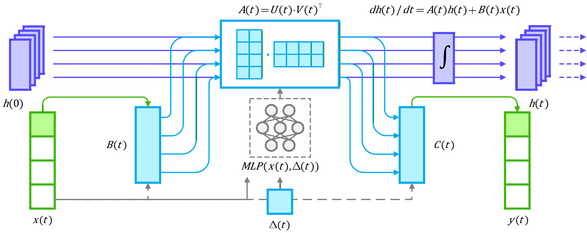
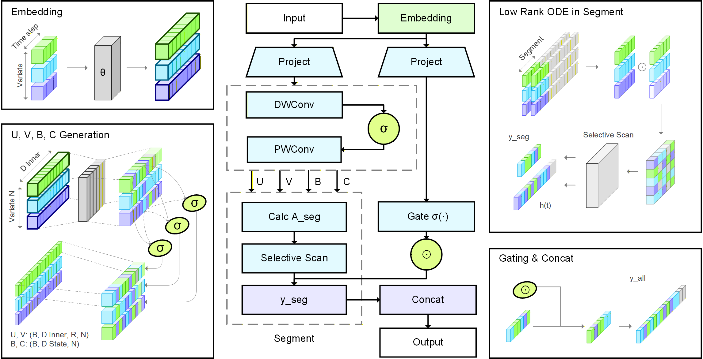
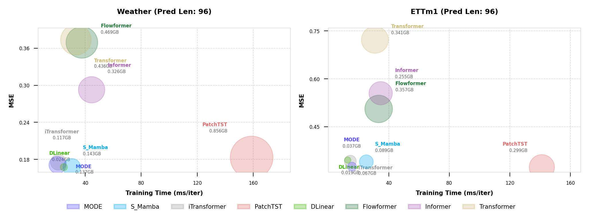

# MODE: Efficient Time Series Prediction with Mamba Enhanced by Low-Rank Neural ODEs

**MODE** (Mamba Enhanced by Low-Rank Neural ODEs) is a novel time series forecasting model that combines the efficiency of State Space Models with the expressive power of Neural Ordinary Differential Equations. This repository provides a comprehensive implementation of MODE and multiple benchmark models for multivariate time series forecasting.

<p align="center">
  
</p>

```bibtex
@article{chen2026mode,
	title={MODE: Efficient Time Series Prediction with Mamba Enhanced by Low-Rank Neural ODEs}, 
	author={Xingsheng Chen and Regina Zhang and Bo Gao and Xingwei He and Xiaofeng Liu and Pietro Lio and Kwok-Yan Lam and Siu-Ming Yiu},
	year={2026},
	eprint={2601.00920},
	archivePrefix={arXiv},
	primaryClass={cs.LG},
	url={https://arxiv.org/abs/2601.00920}, 
}
```

## Overview

Time series forecasting faces significant challenges in modeling complex temporal dependencies while maintaining computational efficiency. MODE addresses these challenges by:

1. **Leveraging Mamba's Efficiency**: Using selective state space models for linear-time sequence processing
2. **Enhancing with Neural ODEs**: Incorporating low-rank neural ODEs to model continuous-time dynamics
3. **Maintaining Scalability**: Supporting long sequences with minimal memory footprint

<p align="center">
  
</p>

## Key Features

- **Low-Rank ODE Enhancement**: Use ODE to reduce time and space complexity while keeping accuracy.
- **SOTA Performance**: Achieves superior forecasting accuracy across multiple benchmarks
- **Computational Efficiency**: Faster training and little GPU memory usage
- **Comprehensive Benchmarking**: Includes implementations of several SOTA time-series forecasting models


## Installation

### Environment Requirements

- Python 3.12.12
- PyTorch 2.8.0 and CUDA 12.8
- Mamba SSM 2.2.5
- Causal Conv1D 1.5.4

### Step 1: Create Conda Environment

Create and activate a new conda environment:
```bash
conda env create -f environment.yml && conda activate mode-py312
```

### Step 2: Install CUDA Runtime

Project is compatible with CUDA 12.8 and PyTorch 2.8.0:
```bash
conda install nvidia/label/cuda-12.8.0::cuda-runtime -y
pip install torch==2.8.0 --index-url https://download.pytorch.org/whl/cu128
```

### Step 3: Install Mamba Dependencies

Install the required CUDA-optimized libraries:
```bash
cd wheels
pip install causal_conv1d-1.5.4+cu12torch2.8cxx11abiTRUE-cp312-cp312-linux_x86_64.whl
pip install mamba_ssm-2.2.5+cu12torch2.8cxx11abiTRUE-cp312-cp312-linux_x86_64.whl
```

### Step 4: Install Additional Dependencies

```bash
poetry install
```

### Verify PyTorch and CUDA setup
```bash
python -c "
import torch
print('PyTorch Version:', torch.__version__)
print('CUDA Available:', torch.cuda.is_available())
print('CUDA Version:', torch.version.cuda)
if torch.cuda.is_available():
	print('GPU Device Name:', torch.cuda.get_device_name(0))
	print('Number of GPUs:', torch.cuda.device_count())
"
```

### Data Download

All datasets can be obtained from the original S-Mamba release:
```bash
# Download datasets from the official repository
wget https://github.com/wzhwzhwzh0921/S-D-Mamba/releases/download/datasets/S-Mamba_datasets.zip
unzip S-Mamba_datasets.zip -d ./data/
```

## Model Architecture

### Low-Rank ODE Enhancement

The MODE model enhances standard Mamba by adding low-rank time-varying components to the state transition matrix:

```
A(t) = U(t)V(t)^T
```

Where:
- **U(t), V(t)**: Matrices of size d*r to calculate the low-rank state transition matrix
- **D State (d)**: dimension of hidden state d_state in Mamba variants.
- **Rank (r)**: Controls the expressive power vs. efficiency trade-off

### Key Parameters

- `d_state`: State dimension
- `r_rank`: Low-rank approximation rank
- `d_conv`: Convolution kernel size
- `expand`: Expansion factor
- `ode_steps`: ODE integration steps
- `ode_solver`: Integration method


## Quick Start

### Multivariate Forecasting Scripts

The easiest way to start is by running the provided shell scripts for each dataset:

```bash
bash ./scripts/multivariate_forecasting/Weather/MODE.sh

bash ./scripts/multivariate_forecasting/ECL/MODE.sh

bash ./scripts/multivariate_forecasting/Exchange/MODE.sh
```

### Key Training Parameters

- `--model`: Model name (MODE, S_Mamba, iTransformer, etc.)
- `--seq_len`: Input sequence length
- `--pred_len`: Prediction horizon
- `--d_state`: Mamba state dimension
- `--r_rank`: Low-rank rank for ODE enhancement
- `--ode_steps`: Number of ODE integration steps
- `--learning_rate`: Learning rate
- `--train_epochs`: Number of training epochs

## Benchmark Models

This repository includes implementations of SOTA forecasting models:

### Mamba-Based Models
- **MODE**: Mamba Enhanced by Low-Rank Neural ODEs (our main contribution)
- **S_Mamba**: Standard Mamba for time series

### Transformer-Based Models
- **iTransformer**: Inverted Transformer architecture
- **Transformer**: Standard Transformer
- **Informer**: Efficient Transformer with ProbSparse attention
- **Reformer**: Reformer's LSH-based attention
- **Flowformer**: Flow-based attention
- **Autoformer**: Autoformer's self-attention mechanism

### Other Baselines
- **PatchTST**: Patch-based time series transformer
- **DLinear**: Simple linear baseline
- **RLinear**: Linear baseline

## Experimental Results

MODE demonstrates superior performance across multiple datasets and prediction horizons:

- **Lower MSE/MAE**: Performs on par with or surpass SOTA baselines on several datasets
- **Multiple Horizons**: Effective for short-term (96 steps) and long-term (720 steps) forecasting
- **Robustness**: Stable performance across different level of gaussian noise.
- **Time & Memory Usage**: MODE shows efficiency in terms of training time and GPU memory usage.


<p align="center">
  
</p>

## Acknowledgements

We extend our gratitude to the creators of excellent projects, including but not limited to:

- **[Mamba](https://github.com/state-spaces/mamba)**: State space sequence model with selective mechanisms
- **[iTransformer](https://github.com/thuml/iTransformer)**: Inverted Transformer for time series forecasting
- **[S-Mamba](https://github.com/wzhwzhwzh0921/S-D-Mamba)**: S-Mamba implementation
